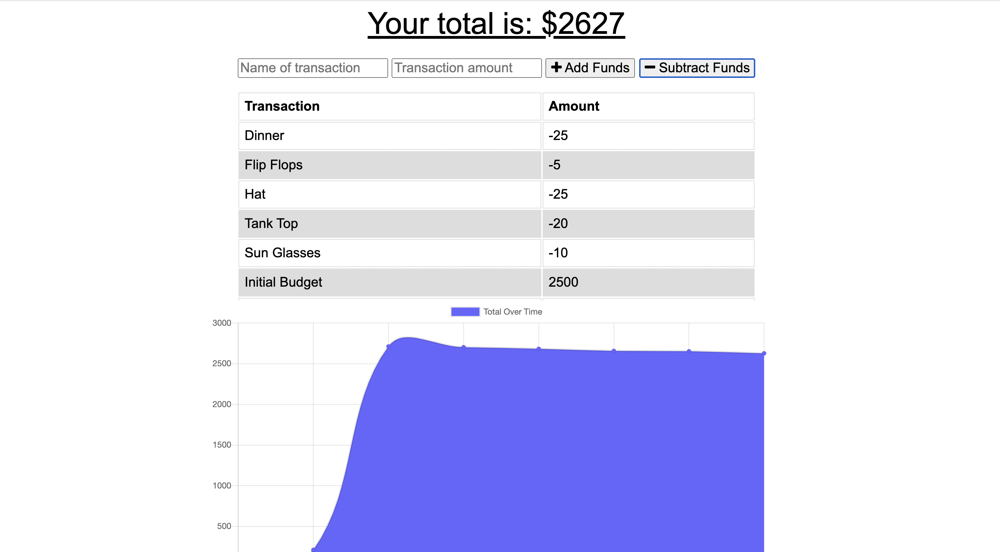

#       PWA Budget Tracker

#       Description 

This application simulates a budget tracker for users to keep a record of expenses for both on and off line use. The user can add, or subtract funds to ther transaction history. While online, the data is then stored in a database powered by MongoDB. When the user is offline, the service-worker.js file caches data to an indexedDB file. The data is then updated when the user returns to an online status.

#       Images

#       Lanuages used

* HTML
* CSS
* JavaScript
* Node.js

#       Dependencies 

* Mongoose
* Compression
* Morgan
* Express
* Lite-server

#       Installation 

* Clone the repo link to your local computer
* Open your intergraded CLI
* Run npm install
* Run npm start

#       Contributors

* Marisa Hanna

#       Deployed Application on Heroku

[https://budgetmyburrito.herokuapp.com/](https://budgetmyburrito.herokuapp.com/)
